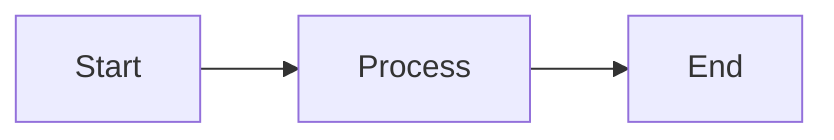

# AgentFlow Docs

API reference documentation site for AgentFlow — a React + FastAPI agentic workflow builder.

## Prerequisites

- Node.js 18+
- npm

## Getting Started

```bash
npm install
npm run dev
```

Open [http://localhost:3000](http://localhost:3000) in your browser.

## Commands

| Command | Description |
|---------|-------------|
| `npm run dev` | Start development server with hot reload |
| `npm run build` | Production build (validates all routes compile) |
| `npm run start` | Serve the production build |
| `npm run lint` | Run ESLint via `next lint` |

## Tech Stack

- **Next.js 16** — App Router with MDX page extensions
- **React 19** / **TypeScript 5**
- **Tailwind CSS 4** — v4 syntax with `@tailwindcss/postcss`
- **MDX 3** — content pages authored in MDX
- **Shiki** — syntax highlighting with CSS variable themes
- **Mermaid** — diagram rendering in MDX code blocks
- **FlexSearch** — full-text search across all pages
- **Framer Motion** — navigation and UI animations
- **Headless UI** — accessible dialogs, tabs, transitions
- **Zustand** — lightweight state for search and mobile nav

## Project Structure

```
├── src/
│   ├── app/                    # Next.js App Router pages
│   │   ├── layout.tsx          # Root layout (providers, fonts)
│   │   ├── globals.css         # Tailwind CSS entry + typography config
│   │   ├── providers.tsx       # Theme provider + ThemeWatcher
│   │   ├── page.mdx            # Homepage
│   │   ├── quickstart/         # Guide pages
│   │   ├── authentication/
│   │   ├── pagination/
│   │   ├── errors/
│   │   ├── webhooks/
│   │   ├── sdks/
│   │   ├── contacts/           # API resource pages
│   │   ├── conversations/
│   │   ├── messages/
│   │   ├── groups/
│   │   ├── attachments/
│   │   ├── agents/             # AgentFlow-specific pages
│   │   ├── workflows/
│   │   └── tasks/
│   ├── components/
│   │   ├── Layout.tsx          # Sidebar + header + footer shell
│   │   ├── Header.tsx          # Top bar with scroll effects
│   │   ├── Navigation.tsx      # Sidebar nav with animated markers
│   │   ├── MobileNavigation.tsx# Slide-in mobile nav panel
│   │   ├── Footer.tsx          # Prev/next page links + copyright
│   │   ├── Code.tsx            # Code blocks, CodeGroup tabs, copy button
│   │   ├── Mermaid.tsx         # Mermaid diagram renderer
│   │   ├── Search.tsx          # Full-text search dialog (Cmd+K)
│   │   ├── mdx.tsx             # MDX component overrides
│   │   ├── Heading.tsx         # Anchor-linked headings
│   │   ├── SectionProvider.tsx # Tracks visible sections for nav highlight
│   │   ├── Button.tsx          # Polymorphic button (5 variants)
│   │   ├── Feedback.tsx        # "Was this page helpful?" widget
│   │   ├── Prose.tsx           # Typography wrapper
│   │   ├── Tag.tsx             # HTTP method tags (GET, POST, etc.)
│   │   ├── ThemeToggle.tsx     # Dark/light mode toggle
│   │   ├── Logo.tsx            # Site logo
│   │   ├── GridPattern.tsx     # SVG grid background
│   │   ├── HeroPattern.tsx     # Homepage hero gradient
│   │   ├── Guides.tsx          # Guide cards grid
│   │   ├── Resources.tsx       # Resource cards with hover effects
│   │   └── Libraries.tsx       # SDK library cards
│   ├── mdx/                    # MDX build plugins
│   │   ├── rehype.mjs          # Shiki highlighting, slugify headings, section export
│   │   ├── remark.mjs          # GFM + MDX annotations
│   │   ├── recma.mjs           # ESM transforms
│   │   ├── search.mjs          # FlexSearch index builder (build-time)
│   │   └── search.d.ts         # Search type definitions
│   ├── lib/
│   │   └── remToPx.ts          # rem-to-px conversion utility
│   └── images/
│       └── logos/              # SDK logo SVGs (Go, Node, PHP, Python, Ruby)
├── typography.ts               # Tailwind typography plugin config
├── mdx-components.tsx          # Registers MDX component overrides
├── next.config.mjs             # Next.js + MDX pipeline config
├── postcss.config.mjs          # PostCSS with Tailwind
└── tsconfig.json               # TypeScript config (@/* → src/*)
```

## Writing Content

### Adding a new page

1. Create `src/app/<route>/page.mdx`
2. Add the route to the `navigation` array in `src/components/Navigation.tsx`
3. The page will be automatically indexed for search on next build

### MDX components

These components are available in all MDX files without importing:

```mdx
## Headings become anchor links automatically

<Note>Callout boxes for important information.</Note>

<Row>
  <Col>Left column content</Col>
  <Col sticky>Right column (sticky on scroll)</Col>
</Row>

<Properties>
  <Property name="id" type="string">
    The unique identifier.
  </Property>
</Properties>

<Button href="/quickstart" variant="text" arrow="right">
  Get started
</Button>
```

### Code blocks

Fenced code blocks get Shiki syntax highlighting automatically. Add metadata with annotations:

````mdx
```json {{ title: 'Example response' }}
{ "id": "abc123" }
```
````

Group multiple code blocks into tabs:

````mdx
<CodeGroup title="Create a task">
```js
const task = await client.tasks.create({ ... })
```
```python
task = client.tasks.create(...)
```
</CodeGroup>
````

### Mermaid diagrams

Use ` ```mermaid ` fenced code blocks to render diagrams. They support dark mode automatically.

````mdx

````

All [Mermaid diagram types](https://mermaid.js.org/intro/) are supported: flowcharts, sequence diagrams, class diagrams, state diagrams, ER diagrams, Gantt charts, etc. You can use `classDef` for custom colors.

### Page metadata

Export a `metadata` object for the page title and description:

```mdx
export const metadata = {
  title: 'Webhooks',
  description: 'How to register and consume webhooks.',
}

# Webhooks
```

## Search

Full-text search is built at compile time using FlexSearch. The search index is generated from all MDX pages by `src/mdx/search.mjs` during the build. Open the search dialog with **Cmd+K** (Mac) or **Ctrl+K** (Windows/Linux).

## Dark Mode

Toggle with the sun/moon button in the header. The site respects the system preference on first load and persists the user's choice via `next-themes`.

## Deployment

```bash
npm run build
npm run start
```

The site is fully static and can be deployed to any hosting platform that supports Next.js (Vercel, Netlify, etc.).
