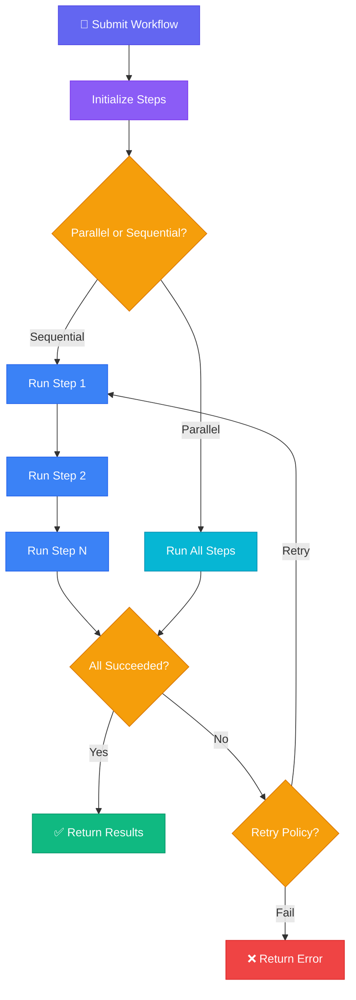

# Workflows

Workflows orchestrate multiple agents into directed acyclic graphs (DAGs). They define execution order, dependencies, and conditional branching. {{ className: 'lead' }}

Each workflow is composed of steps that reference agents and tasks. You can configure timeouts, retry policies, and failure strategies. Use the endpoints below to create, manage, and run workflows programmatically.

## Workflow execution flow

